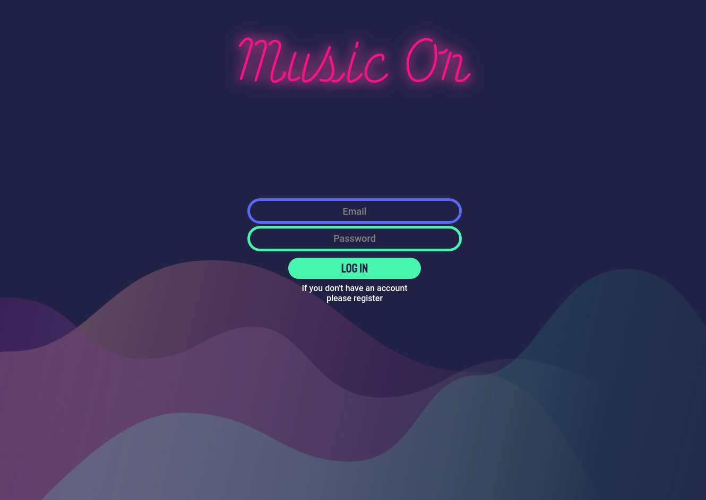
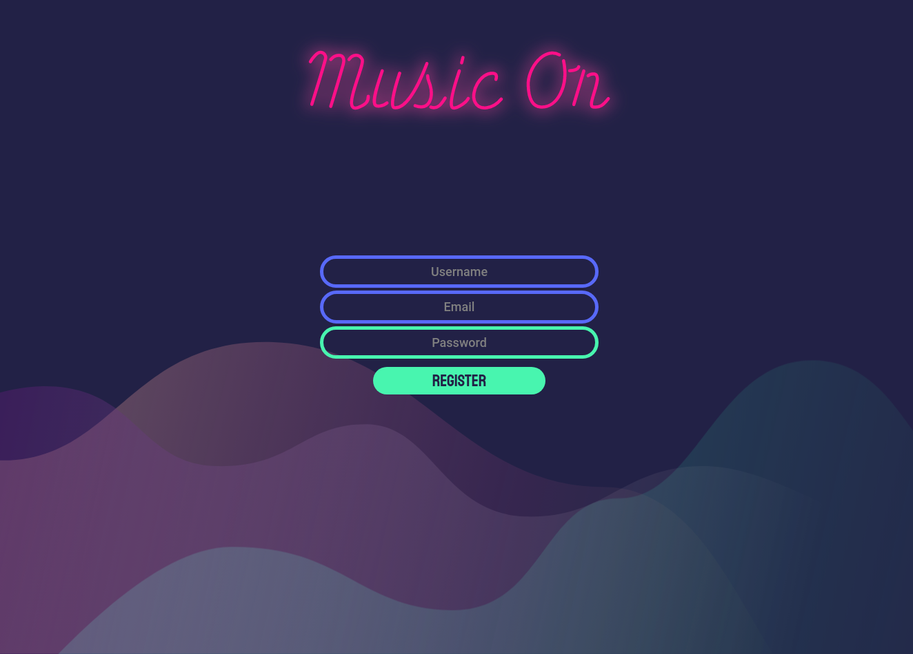
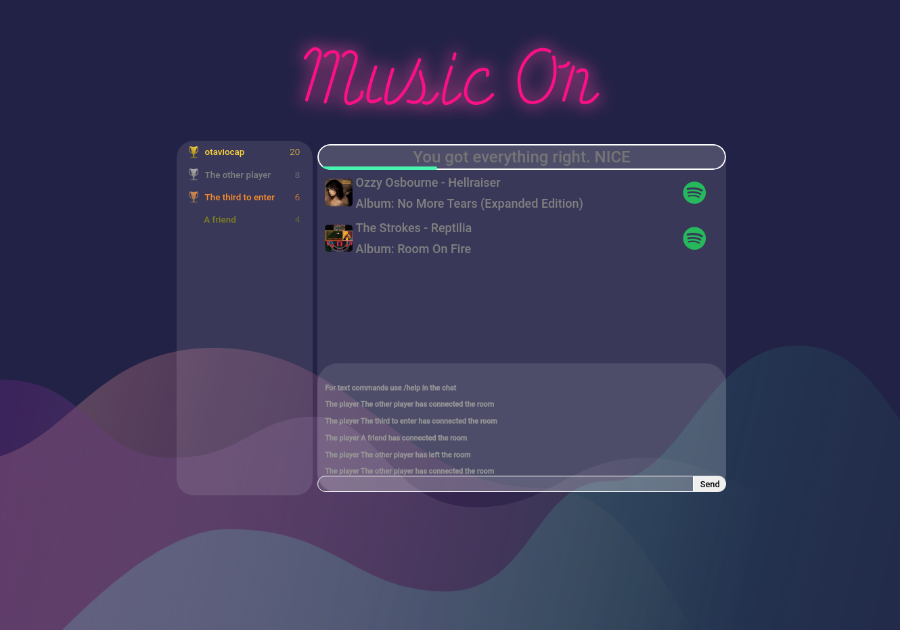

# Music On (Frontend)

This is the frontend for the application Music On, the music guessing game.
Music On is a guessing game for your own Spotify playlists, here you can register and play with your friends

## Topics
- [Music On (Frontend)](#music-on-frontend)
  - [Topics](#topics)
  - [Installation](#installation)
  - [Usage](#usage)
  - [Playing](#playing)
    - [Registering](#registering)
    - [Adding playlists](#adding-playlists)
    - [Creating a room](#creating-a-room)
    - [Playing](#playing-1)
    - [Score](#score)
    - [Winning](#winning)
  - [Contributing](#contributing)
  - [License](#license)


## Installation

First we need to have the backend of the application up and running, for that please install the [MusicOn Backend](https://github.com/otaviocap/MusicOn-Backend#installation)

After installing it you need to configure the **Info.template.js** with some simple information. First make a copy and rename it to **Info.js** and there put your ip and the port of your server running the backend

After this need to install all the dependencies

```bash
npm install
```

## Usage

It's simple, you can start using
```bash
npm start
```

If everything went right you web browser will open and you should see a register page like this



## Playing
To play you need to register in the web site

### Registering



### Adding playlists
After registering you will be greated with an interface to add your playlists to the game


### Creating a room
To create a room just select the playlist you want to play and configure the room


### Playing
To play with your friends, just send the game url, when they open it they will be greeted with a username screen, where they can choose a username


### Score
The score depends on how fast you got the artist and the song right
| State  |         Condition         | Score |
| :----: | :-----------------------: | :---: |
| First  | Be the first to get both  |  +10  |
| Second | Be the second to get both |  +8   |
| Third  | Be the third to get both  |  +6   |
|  Both  |         Get both          |  +6   |
|  One   |       Get just one        |  +2   |

Here you can see how the game will display the different states





### Winning
The game will end when one player reaches the max score. When this happens all the scores will be reset, and in the chat will show the winners


## Contributing

Pull requests are welcome. For major changes, please open an issue first to discuss what you would like to change.

Please make sure to update tests as appropriate.

## License

[GPL-3.0](https://choosealicense.com/licenses/gpl-3.0/)
